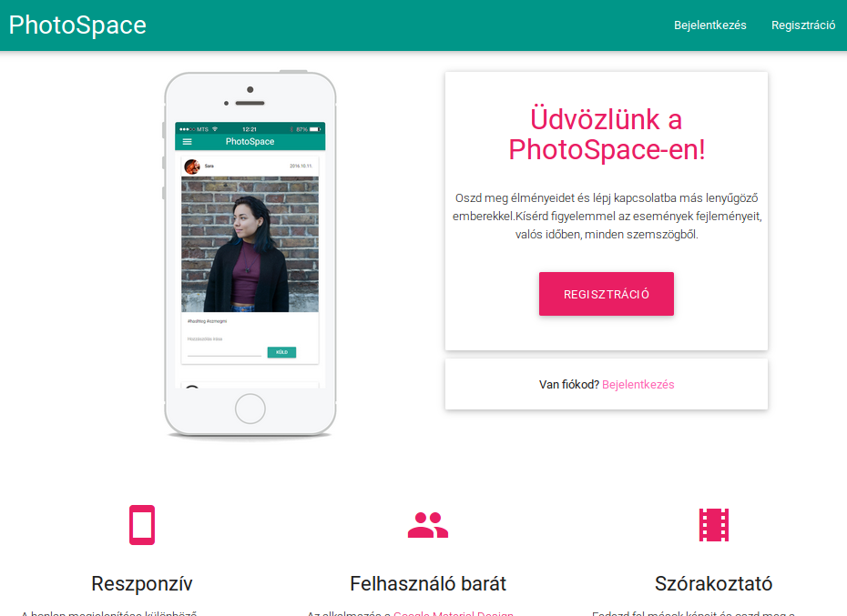

# Alkalmazások fejlesztése beadandó (PhotoSpace){

*Nagy Gergely -- JJSR78*
[//]: # (https://help.github.com/articles/creating-and-highlighting-code-blocks/)
## Tartalomjegyzék

  1. [Az értékelés összetevői](#az-értékelés-összetevői)
  1. [Feladat vállalása](#feladat-vállalása)
  1. [Alkalmazás elkészítése szerveroldali technológiával](#alkalmazás-elkészítése-szerveroldali-technológiával)
  1. [A szerveroldali alkalmazás progresszív fejlesztése kliensoldali JavaScript segítségével](#a-szerveroldali-alkalmazás-progresszív-fejlesztése-kliensoldali-javascript-segítségével)
  1. [Implementáció](#implementáció)
  1. [Felhasználói dokumentáció](#felhasználói-dokumentáció)

## Az értékelés összetevői

- [x] Feladat vállalása (2016. október 16. éjfél)
- [x] Alkalmazás elkészítése szerveroldali technológiával (2016. november 13. éjfél)
- [ ] A szerveroldali alkalmazás progresszív fejlesztése kliensoldali JavaScript segítségével (2016. december 18. éjfél)

## Feladat vállalása

- [2.1](#cel) **Célkitűzés, projektindító dokumentum**: 

A projekt az ELTE Informatikai kar Alkalmazások fejlesztése tárgy első beadandója során készült. A projekt rövid leírása: a cél egy közösségi háló felépítése, ahol a felhasználók képeket oszthatnak meg regisztráció majd bejelentkezést követően. A képek egy úgynevezett kártyán helyezkednek el, ami a képeken kívül tartalmazza, hogy ki osztotta meg a képet, a kép címét, a megosztás dátumát, és a kép kategóriáját is. A felhasználónak lehetősége van a saját kártyái módósítására és törlésére, és a többi felhasználó kártyáit is megtekintheti. Ezenfelül kategóriák szerint szűrhetőek a kártyák.

- [2.2](#fogalom) **Szakterületi fogalomjegyzék**: 

<b>Regisztráció: </b>Egy folyamat ami után a vendég, "felhasználó" rangot kap. 
<b>Felhasználó: </b>Egy személy aki regisztráció után belépett az alkalmazásba. 
<b>Kép: </b>A felhasználó által megosztani kivánt JPG vagy PNG formátumú fájl. 
<b>Kategória: </b>Képek csoportosítására használt címke, ami lehet: 
  [ Vicces | Játék | Zene | Sport | Állatok | Tánc | Ijesztő | Autók | Étel | Művészet ] 
<b>Kártya: </b>Egy komponens ami tartalmazza a felhasználó nevét, egy képet, a kép címét, kategóriáját és feltöltési dátumát. 

- [2.3](#funkc) **Funkcionális követelmények**: 

<b>Főoldal: </b>Elrejti az alkalmazást a vendégek elől. Felkelti a vendég érdeklődését a regisztrációra.  
<b>Regisztráció: </b>Lehetővé teszi egy vendégnek, hogy használhassa az alkalmazást.  
<b>Bejelentkezés: </b>Jelszóval védi a felhasználó adatait, és a jelszóval védett funkciókat megjeleníti. Ezzel védve a felhasználót illetve az alkalmazást is az illetéktelenektől. Bejelentkezés után elérhető funkciók:  
  - <b>Kép feltöltése: </b>Feltölthessünk saját képet.  
  - <b>Kép törlése: </b>Saját képeinket törölni tudjuk.  
  - <b>Hozzászólás írása: </b>Meglévő képekhez tudjunk hozzászólást írni.  
  - <b>Kategória alapján szűrés: </b>Képeket szűrhetjük kategóriák szerint.  
  - <b>Profiladatok szerkesztése: </b>Profilunk adatait lehetőség legyen megváltoztatni.  
  - <b>Profil törlése: </b>Nem használt profilunkat lehetőség legyen törölni az adatbázisból.  
  
<b>Kijelentkezés: </b>Felhasználó által használható funkció a bejelentkezett folyamat megszüntetésére.  
  

- [2.4](#nemfunkc) **Nem funkcionális követelmények**: 

<b>Könnyű áttekinthetőség: </b>Az alkalmazás a <a href="https://material.google.com/">Google Material Design</a> irányvonalait kövesse.Gyors és egyszerű használatot biztosítson a felhasználóknak. Az implementáláshoz a <a href="http://materializecss.com/">Materialize</a> keretrendszert használom. 
<b>Megbízhatóság: </b>A jelszavakat ne plain-textbe tároljuk. Figyeljünk a jelszavak erősségére(legalább 6 karakter, szám + kis-,nagybetű). Jelszóval védett funkciók, ezzel védve a felhasználók érzékeny adatait.  
<b>Skálázhatóság: </b>Az alkalmazás legyen skálázható, több felhasználó is képes legyen szinkron használni.  
<b>Karbantarthatóság: </b>Különböző rétegekhez tartozó forrásfájlokat külön mappákba csoportosítsuk, figyeljünk a Clean Code elvekre. Írjunk teszteket az alkalmazás fejlesztése közben ( akár TDD ).

- [2.5](#hasznal) **Használatieset-modell**: 

**Szerepkörök:**

 - Vendég ( csak regisztrációhoz és bejelentkezéshez van jogosultsága )
	 - Főoldal
	 - Bejelentkezés
	 - Regisztráció
 - Felhasználó ( alkalmazás funkciói elérhetőek számára)
	 - Képek listázása
	 - Képek hozzáadása
	 - Képek szerkesztése
	 - Képek törlése
	 - Felhasználói adatok szerkesztése
	 - Saját felhasználói fiók törlése
	 - Hozzászólások írása

**Vegyünk példának egy egyszerű folyamatot:**

 - ***Felhasználó törlése:***
 
 1. Az oldalra lépett vendég bejelentkezik vagy regisztrál.
 2. Bejelentkezés után a felhasználó a navigációs sávon megnyithatja a profiladatokat tartalmazó oldalt.
 3. Megnyomja a "Szerkesztés" gombot.
 4. A profil szerkesztése oldalon megnyomja a "Felhasználó törlése" gombot.
 5. A felhasználó visszakerül az üdvözlő oldalra.

## Alkalmazás elkészítése szerveroldali technológiával

- [3.1](#arch) **Architektúra terv**:

***Oldaltérkép:***

##### Publikus
- Belépés
- Regisztráció
- Üdvözlő oldal megtekintése

##### Bejelentkezett
- Képek listázása
	- *Hozzászólások írása* 
- Saját profil megtekintése
	- *Saját képek törlése*
	- *Saját képek hozzáadása*
	- *Saját képek szerkesztése*
	- *Saját profil szerkesztése*
	      - Felhasználói fiók törlése 
- Kijelentkezés

***Végpontok:***

| Metódus | Cím | Funkció|
|:-------:|:---:|--------|
|GET|/|Főoldal megjelenítése.
|GET|/login|Bejelentkező oldal megjelenítése.
|POST|/login|Bejelentkezés.
|GET|/logout|Kijelentkezés.
|GET|/register|Regisztrációs oldal megjelenítése.
|POST|/register|Regisztráció.
|GET|/cards/create|Új kép adatait módosító űrlap megjelenítése.
|GET|/user/:users/cards|Felhasználó képeinek megjelenítés.
|GET|/user/:users/cards/:id/edit|Kép módosító űrlap megjelenítése.
|POST|/cards/create|Új Kép feltöltése.
|POST|/user/:users/cards/:id/edit|Kép módosítása.
|POST|/user/:users/cards/:id/delete|Kép törlése.
|POST|/user/:user_id/cards/:card_id/sendComment|Új komment küldése.
|GET|/user/:users/edit|Felhasználói fiók módosító ürlap megjelenítése.
|POST|/user/:users/edit|Felhasználói fiók módosítása.
|POST|/user/:users/delete|Felhasználói fiók törlése.

- [3.2](#felulet) **Felhasználóifelület-modell**:

| Oldal neve | Oldalvázlat | Designterv |
|:----------:|:-----------:|------------|
|Üdvözlő oldal|  | 
|Főoldal|  | 
|Profil oldal|  | 
|Profil szerkesztés oldal|  | 

- [3.3](#osztalymodell) **Osztálymodell**:

***Adatmodell:***

***Adatbázisterv:***

***Állapotdiagram:***

Vegyünk példának a regisztrációt, majd egy új kép feltöltését, mindezt szekvenciadiagrammon.

## Implementáció

- [4.1](#fejlkorny) **Fejlesztői környezet bemutatása**:

## A szerveroldali alkalmazás progresszív fejlesztése kliensoldali JavaScript segítségével

### Tesztelés

A tesztelés Selenium IDE használatával valósul meg. 
Elérés: https://addons.mozilla.org/hu/firefox/addon/selenium-ide/  
1. Le kell tölteni a Selenium IDE-t. 
2. Firefoxban Selenium megnyitása. 
3. Piros gomb megnyomásával a tesztelni kívánt feladatsor felvétele. 
4. Piros gomb újbóli megnyomása a felvétel leállításához. 
5. Play entire test suite gombbal a tesztek lejátszása. 
6. Ctrl+S billentyűkombinációval teszt mentése. 

Tesztesetek: 

### Telepítés

#### Előkövetelmény
- [Git](https://git-scm.com/)

#### macOS

Töltsd le a legújabb [Atom verziót](https://github.com/atom/atom/releases/latest).

Atom automatikusan frissit, ha új verzió érhető el.

#### Windows

Töltsd le a legújabb [Atom telepítőt](https://github.com/atom/atom/releases/latest).  AtomSetup.exe-t a 32-bites, AtomSetup-x64.exe-t a 64-bites rendszerhez.

Atom automatikusan frissit, ha új verzió érhető el.

#### Debian Linux (Ubuntu)

Atom csak a 64-bites Linux rendszerekhez érhető el.

1. Töltsd le az `atom-amd64.deb` fájlt a [Atom oldaláról](https://github.com/atom/atom/releases/latest).
2. Futtasd `sudo dpkg --install atom-amd64.deb` parancsot a letöltött mappában.
3. Indítsd el az Atomot a telepített `atom` paranccsal.

A Linuxos verzió nem frissít automatikusan, így megkell ismételni a lépéseket az új verzió telepítéséhez.

### Használat

1. Atom IDE elindítása.
2. Project mappa megnyitása.
3. Kód írása.
4. Githubra feltöltés:
  1. git add paranccsal kiválaszthatunk egy fájlt verzionálásra, vagy git add . paranccsal az összes fájlt kiválaszthatjuk.
  2. git commit -m "commit" paranccsal feltehetjük a fájlokat a helyi tárolójába. Az így megjelölt verziókhoz a későbbiekben visszatérhetünk, különbségüket megtekinthetjük.
  3. git push origin master paranccsal a lokális tárolóból feltölthetjük a tartalmat a Github-ra.
5. Végezetül a Github oldalán leellenőrizhetjük a munkánkat.

- [4.2](#mappa) **Könyvtárstruktúrában lévő mappák funkciójának bemutatása**:

* **Photospace**
  * **app**: Alkalmazás fájlai.
    * **Commands**
          * _Greet.js_
     * **Http**
          * **Controllers** 
             * _CardController.js_
             * _HomePageController.js_
             * _ProfileController.js_
             * _RegisterController.js_
             * _AuthController.js_
          * _kernel.js_
          * _routes.js_
     * **Listeners**
          * _Http.js_
     * **Model**: Adatbázis kapcsolatokat leíró fájlok.
          * _Card.js_
          * _Category.js_
          * _Comment.js_
          * _Token.js_
          * _User.js_
  * **config**: Beállításokat tartalmazó mappa.
    * _app.js_
    * _auth.js_
    * _database.js_
    * _event.js_
    * _session.js_
    * _shield.js_
  * **database**: Adatbázishoz kapcsolódó fájlok.
    * **migrations**: Adatbázis táblák sémáját leíró fájlok.
      * _users_table.js_
      * _tokens_table.js_
      * _categories.js_
      * _cards.js_
      * _Comment.js_
    * **seeds**
      * _Database.js_
    * _factory.js_
    * _PhotoSpace.sqlite_
  * **public**: 
    * **css**
    * **img**
  * **resources**
    * **views**: Nézeteke leíró nunjucks fájlok
      * _cardCreate.njk_
      * _cardEdit.njk_
      * _login.njk_
      * _master.njk_
      * _profileEdit.njk_
      * _profileShow.njk_
      * _register.njk_
      * _welcome.njk_
  * _.env_
  * _package.json_
  * _server.js_

## Felhasználói dokumentáció

- [5.1](#futas) **A futtatáshoz ajánlott hardver-, szoftver konfiguráció**:

***Ajánlott rendszerkövetelmény:***

Hardver:
- _Pentium 4 or newer processor that supports SSE2_
- _512MB of RAM_
- _200MB of hard drive space_
    
Szoftver:
- [Git](https://git-scm.com/)
- [npm](https://www.npmjs.com/)
- [nodejs](https://nodejs.org/)

+IDE a fejlesztéshez([Atom](https://github.com/atom/atom/releases/latest),[Nodepad++](https://notepad-plus-plus.org/)).

- [5.2](#install) **Telepítés lépései: hogyan kerül a Githubról a célgépre a program, hogyan kell elindítani**:

1. Kód letöltése

    a. ZIP letöltése

    b. gergi30/alkfejl-2016-beadando klónozása

    c. gergi30/alkfejl-2016-beadando forkolása és a saját repo klónozása

2. `npm install`
3. `.env.example` fájl átnevezése `.env`-re
4. `npm run dev` paranccsal futtatni
5. `localhost:3333` megnyitása

- [5.3](#phasznalat) **A program használata**:

1. Böngészőbe nyissuk meg az oldalt.
2. Az oldalon használhatjuk a Bejelentkezés / Regisztráció gombokat.
3. Bejelentkezés / Regisztráció után a már feletöltött képek listaoldalára jutunk. (Hozzászólhatunk a már meglévő képekhez)
4. A navigációs sávon található gombbal megnyithatjuk profilunkat.
5. Profil oldalon felvehetünk új képeket, törölhetjük, szerkeszthetjük meglévő képeinket.
6. Szerkesztés gomb megnyomásával megjelenik a profiladatok szerkesztése űrlap.

# };
